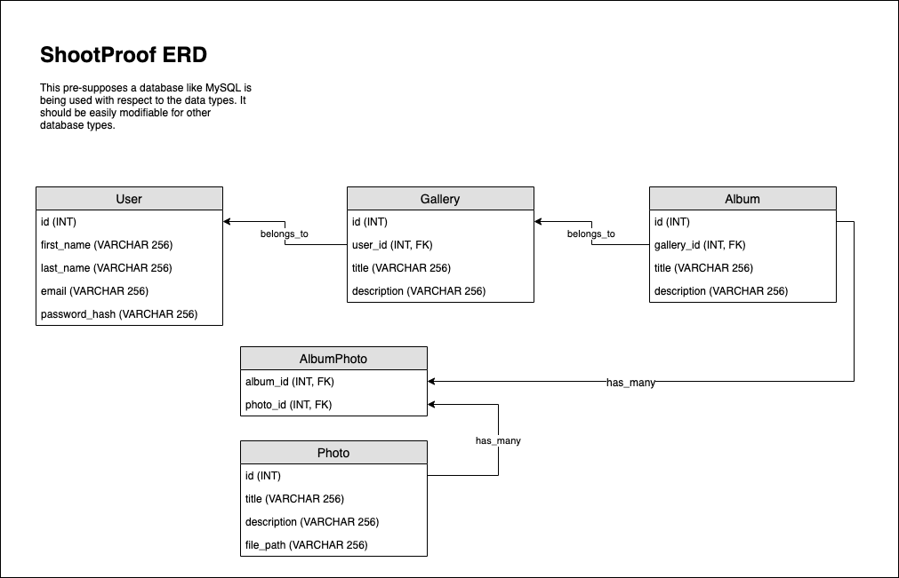

# Entity Relationship Diagram for ShootProof

Below is a fairly straight forward data model describing the relationships in the proposed system.

As mentioned in the diagram, this pre-supposes a RDBMS such as MySQL or SQLite, but would be flexible to many other systems.
